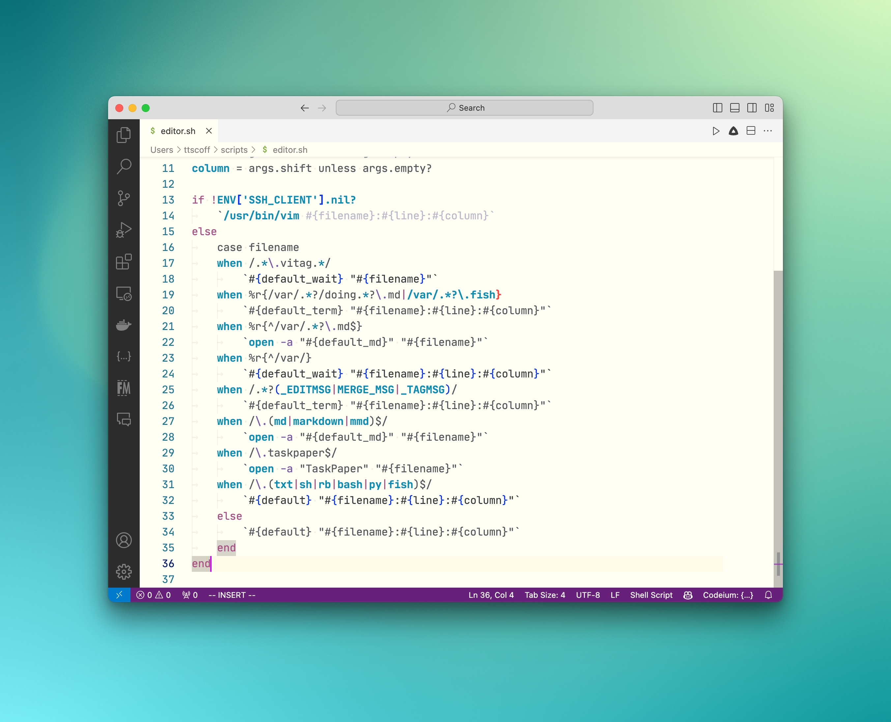

# Lucky Charms

A light theme for VS Code.

[github]: https://github.com/ttscoff/LuckyCharms-vscode

## Installation

1. Download the `.vsix` file
2. open the command palette in VS Code
3. Select "Install from vsix"
4. Locate the `.vsix` file and select it

Now you can use the Color Theme preference to select Lucky Charms.
